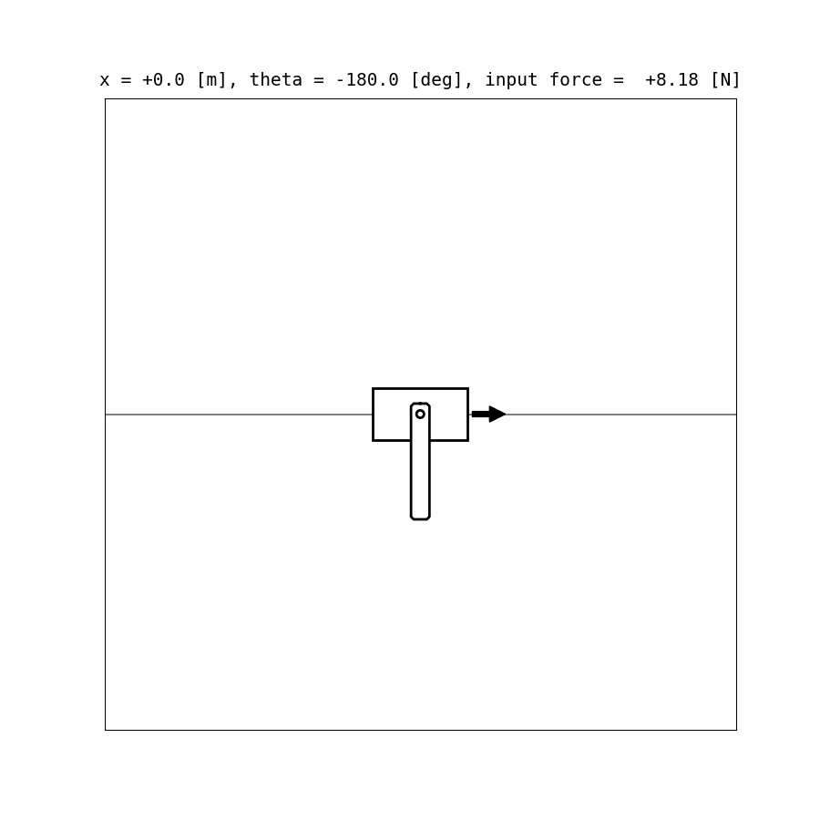

[](https://opensource.org/licenses/MIT)
[](https://github.com/astral-sh/uv)
[](https://www.docker.com/)

# Simple MPPI Implementation with Python
Model Predictive Path-Integral (MPPI) Control [[G. Williams et al., 2018]](#references) is a promising sampling-based optimal control algorithm.  
This repository is for understanding the basic idea of the algorithm.




## Dependency

- [uv](https://docs.astral.sh/uv/getting-started/installation/)  
  - A simple and fast Python package manager.
    Refer to the official documentation for one-command installation.
  - Only `numpy`, `matplotlib`, `notebook` are needed to run all scripts in this repository.

- [ffmpeg](https://ffmpeg.org/)
  - mp4 movie writer
  - <details>
    <summary>installation details</summary>

    - For Ubuntu Users
        - `sudo apt-get update`
        - `sudo apt-get -y install ffmpeg`
    - For Windows Users
        - Install [scoop](https://scoop.sh/)
        - `scoop install ffmpeg`
    - For macOS Users
        - Install [homebrew](https://brew.sh/)
        - `brew install ffmpeg`
    - Check the official website if necessary
        - https://ffmpeg.org/

    </details>

## Setup
### [Option 1] Native environment
```sh
git clone https://github.com/MizuhoAOKI/python_simple_mppi.git
cd python_simple_mppi
uv sync
```

### [Option 2] Docker environment
<details>
<summary>CLICK HERE TO EXPAND</summary>

1. Install [docker](https://docs.docker.com/engine/install/).

1. Clone the project repository.
    ```
    cd <path to your workspace>
    git clone https://github.com/MizuhoAOKI/python_simple_mppi.git
    ```

1. Run for the first time setup to build the docker image. Building the image might take a few minutes.
    ```
    cd <path to your workspace>/python_simple_mppi
    docker build -t dev_mppi:v1.0 -f docker/Dockerfile .
    ```

1. Launch the docker container and get into the bash inside.
    ```
    cd <path to your workspace>/python_simple_mppi
    docker run -it -v .:/dev_ws/python_simple_mppi --name dev_mppi_container dev_mppi:v1.0 bash
    ```
    Once the container starts, any changes made in the local repository on the host will be reflected inside the container, and vice versa.

</details>


## Usage

### Path Tracking


#### Simple Path Tracking
- Run simulation
    ```sh
    cd python_simple_mppi
    uv run scripts/mppi_pathtracking.py
    ```

- Run jupyter notebook if you would like to check mathematical explanations on the algorithm.
    ```sh
    cd python_simple_mppi
    uv run jupyter notebook --notebook-dir=. notebooks/mppi_pathtracking.ipynb
    ```

#### Path Tracking with Obstacle Avoidance
- Run simulation
    ```sh
    cd python_simple_mppi
    uv run scripts/mppi_pathtracking_obav.py
    ```

- Run jupyter notebook if you would like to check mathematical explanations on the algorithm.
    ```sh
    cd python_simple_mppi
    uv run jupyter notebook --notebook-dir=. notebooks/mppi_pathtracking_obav.ipynb
    ```

### Pendulum


- Run simulation to swing up a pendulum.
    ```sh
    cd python_simple_mppi
    uv run scripts/mppi_pendulum.py
    ```

- Run jupyter notebook if you would like to check mathematical explanations on the algorithm.
    ```sh
    cd python_simple_mppi
    uv run jupyter notebook --notebook-dir=. notebooks/mppi_pendulum.ipynb
    ```

### CartPole


- Run simulation of cartpole
    ```sh
    cd python_simple_mppi
    uv run scripts/mppi_cartpole.py
    ```

- Run jupyter notebook if you would like to check mathematical explanations on the algorithm.
    ```sh
    cd python_simple_mppi
    uv run jupyter notebook --notebook-dir=. notebooks/mppi_cartpole.ipynb
    ```

## References
1. G. Williams et al. "Information-Theoretic Model Predictive Control: Theory and Applications to Autonomous Driving" 
    - URL : https://ieeexplore.ieee.org/document/8558663
    - PDF : https://arxiv.org/pdf/1707.02342.pdf
